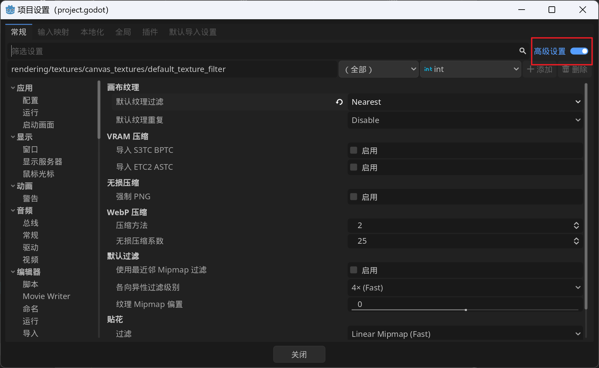
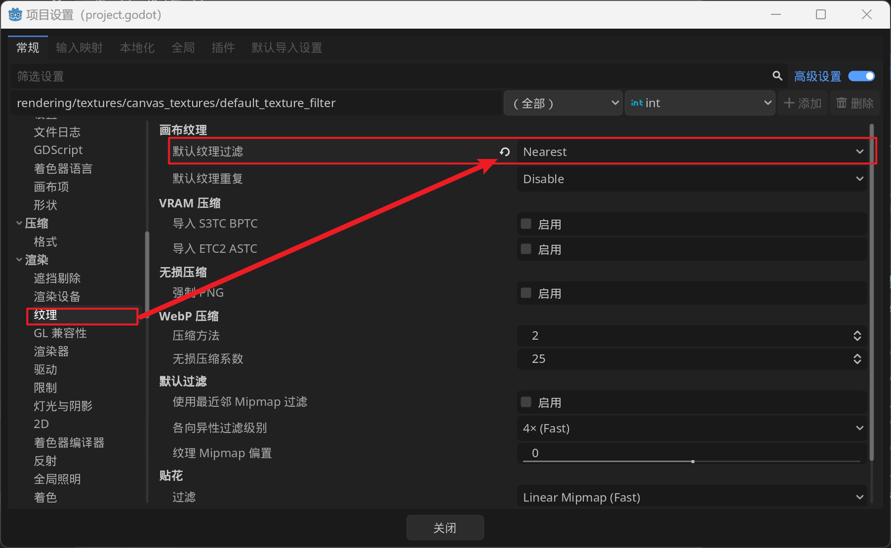
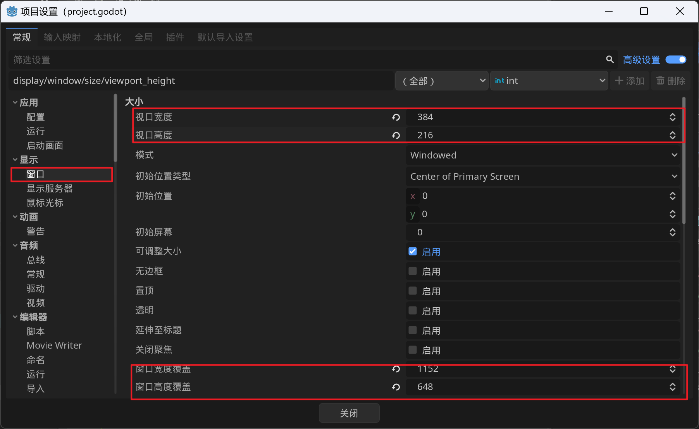
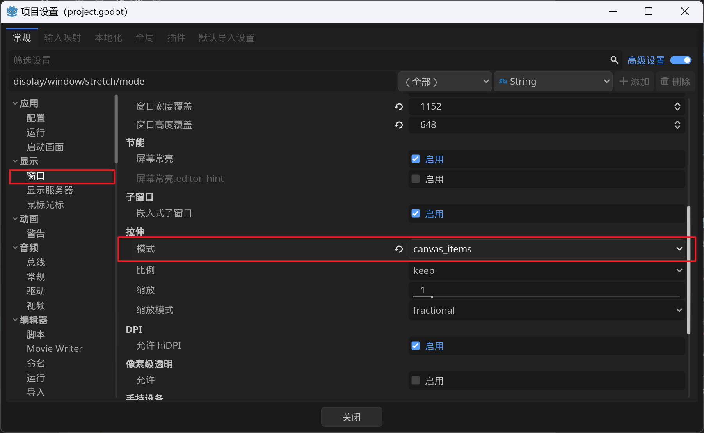

# Treasure-Hunter

## 目录结构

- `assets`: 存放艺术资源
- `component`: 组件,给某个节点赋予一个功能
- `character`: 逻辑上的游戏角色
- `entity`: 逻辑上的游戏物品
  - `interactable`: 可互动实体
  - `static`: 静态实体
- `scene`: 游戏世界场景,关卡

## 架构

### 角色

- 角色父节点: `BasicCharacter`
  - 图形组件: `Graphics`
  - 方向组件: `Direction`
  - 状态机组件: `StateMachine`

### 对话系统

气泡管理器

对话气泡

情绪气泡

## 项目设置

首先开启高级设置选项,此选项会开放更多的设置内容

2d像素游戏中,需要修改纹理过滤方式为`Nearest`, 以便得到清晰的像素图形

调整窗口大小以及画面缩放比例

窗口高度/宽度覆盖表示固定窗口的尺寸的大小

视口高度/宽度表示实际显示的游戏游戏画面的大小,这里将视口宽高设为窗口宽高的1/3

然后将画面拉伸模式设为`canvas_items`:  将游戏画面拉伸至覆盖整个屏幕

最终效果就是游戏画面放大3倍显示

## 详解

### 状态机

